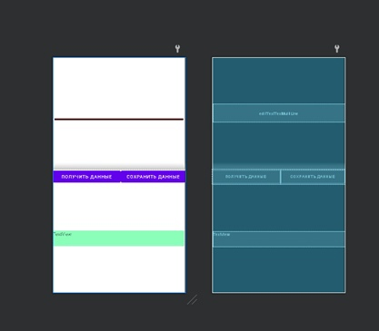
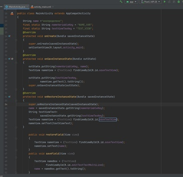
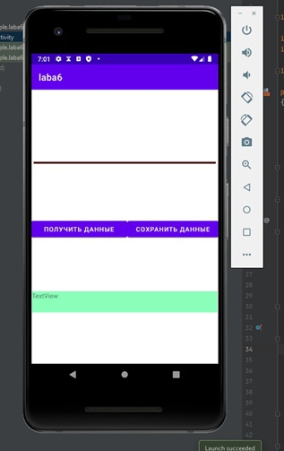
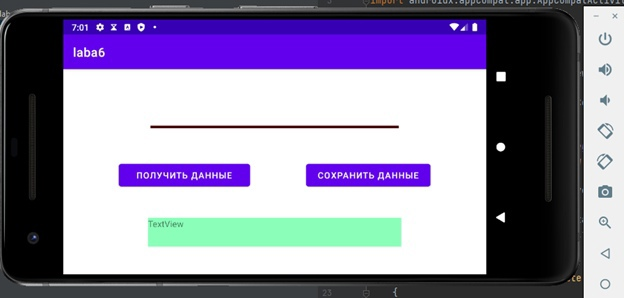

# laba6
Laba Mobilki (TepluhinLev 803a2)

1.	Добавил поле EditText тип textMultiLine и 2 кнопки – получить данные и сохранить данные.

2.	Создал для них обработчики событий

3.	Проверяю работа способность в виртуальном телефоне

4.	Все работает! 

